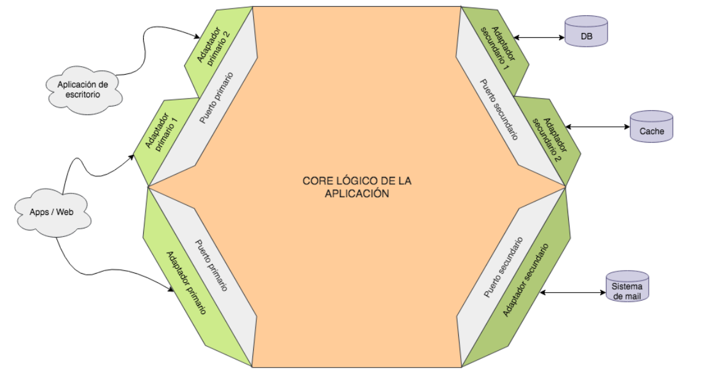

# Hexagonal Architecture

También conocida como Puertos y Adaptadores (Ports and Adapters), se basa en la separación del dominio de negocio de los detalles de implementación. Todas las entradas y salidas de la
aplicación se exponen a través de puertos.



## Ports

Los **puertos** son las interfaces que definen la interacción con el exterior y exponen únicamente datos de nuestro dominio, dejando que toda la lógica de transformación esté de puertas afuera y no se contamine el interior.

## Adapters

Y los **adaptadores** son precisamente la forma de conectar el exterior con los puertos, implementando la comunicación y la conversión de datos entre el dominio y lo que se necesite fuera. Los adaptadores no pertenecen al core como tal y podrían implementarse cada uno completamente por separado si quisiésemos mientras dependan del puerto que usan/implementan.

## _Ventajas_

- Mas fácil de testear
- Arquitectura más mantenible a largo plazo
- Flexibilidad en cuanto a tecnologías externas
- Nos permite retrasar al maximo la eleccion de la tecgnologías

## _Desventajas_

- Arquitectura muy pesada ya que se agregan muchas clases e interfaces
- Coste de adaptación por parte de los desarrolladores nuevos que no son tan expertos en la arquitectura lo que impacta en los tiempos de las primeras actividades.
- Puede ser confuso al aplicar con frameworks muy extrictos ya que se debe considerar al framework como algo externo también.

## _Cuando usar_

- Proyectos grandes.
- Proyectos con tiempos de vida muy largos
- Necesidad de una mayor flexibilidad en cuanto a tegnologias.
- Equipos relativamente expertos, almenos deberia haber 1 o 2 expertos en la arquitectura.

## TypeORM Migration Comands

Si una entidad dao cambia deberiamos generar un cambio en nuestras migracionesy de esta manera
va quedando un registro de cambios en la base de datos.

Si algo sale mal podemos ejecutar revert

Si cambia algo en algun dao, se debe generara un nueva migracion y luego esto se correra en el servidor de integracion continua.

1- You can create a new migration using CLI:

```
typeorm migration:create migrations/migrationName

```

2- Generate migration from entities:

```
 npm run typeorm migration:generate -- src/config/db/migrations/NewMigration
```

3- To execute all pending migrations use following command:

```
typeorm migration:run -- -d src/config/db/migrations
```

4- Revertir cambios

```
typeorm migration:revert -- -d src/config/db/migrations
```
